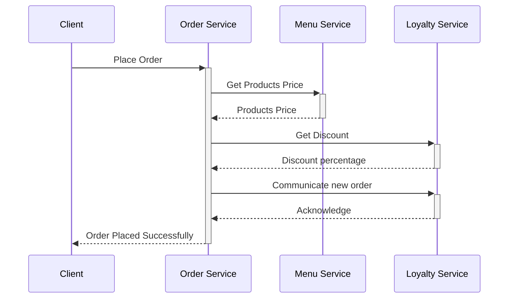
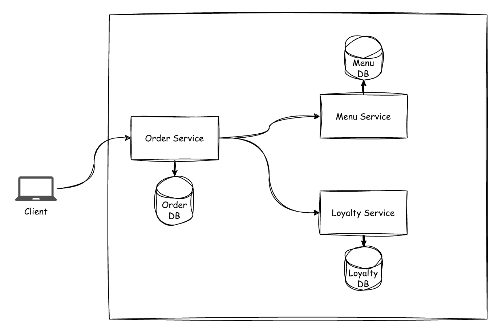
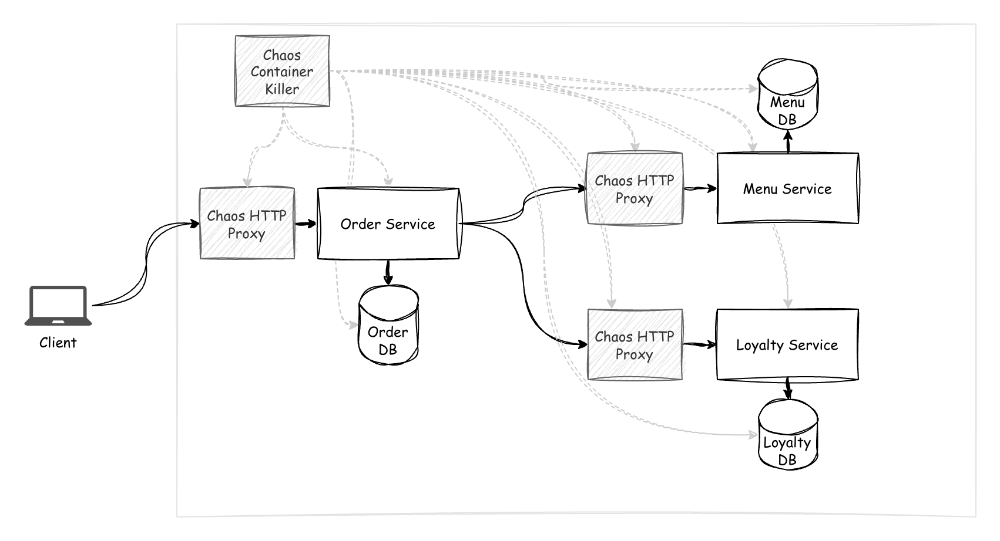

# Chaos Workshop (WIP)

This repository contains code and resources to accompany in delivering workshops on the basics of resiliency and chaos engineering practices.

**Technical requirements:**

- Docker & Docker Compose
- .NET 10 SDK

## High level overview

The theme of the workshop is an imaginary restaurant ordering system, where customers can place orders for food.

The system is composed of several microservices, which interact with each other to fulfill customer orders.

When getting started with the workshop, the code for a functional, though not resilient. Participants focus will be on the Order Service, which is the entry point for customers placing orders.

Some elements of chaos engineering are sprinkled across the system, so the participants can experience the impact and work on mitigating the issues. Some examples of these elements include: network latency, network failures, service and database outages.

A client application is provided to simulate customers placing orders, then assert that the system is resilient to the various issues introduced.

When placing an order, the client application will keep retrying until a successful response is received from the Order Service's API. This is not a realistic scenario, but it makes the exercise more deterministic and easier to follow.

The following diagram illustrates the sequence of interactions between the various services in the system when placing an order:

And the following, is just a very basic high level view of the existing components:

## Workshop objectives

The objective of the workshop is to get participants to consider different failure scenarios, how they affect the system, and how to mitigate them.

While the workshop exercise focuses on tweaking the Order Service to make it withstand the various issues introduced, hopefully participants will also be able to begin thinking about potential adjustments to the overall system design and architecture, in order to make it more resilient.

Given the artificial nature of the exercise, it's entirely possible that something solves it, but is not the best approach in a real-world scenario. For this reason, participants should be encouraged to think critically about the solutions proposed and implemented, not just assume they are the best approach because they worked in the workshop context.

## Chaos components

To introduce chaos into the system, the following components are used:

- http proxy: a proxy is used to introduce network latency and failures between services
- container disruptor: a component that randomly disrupts containers to simulate service and database outages

We can include the components in the component diagram, just to make things clearer:

## Doing the workshop exercise

As alluded earlier, the focus of the workshop exercise is on the Order Service.

You should analyze how the system as a whole behaves, analyze the Order Service code, identify potential points of failure, then design strategies to mitigate them. If time allows it, implementing the strategies would be ideal to further reinforce learning.

Getting the system up and running is a matter of executing `make run-all`. If `make` is not available, you can check its corresponding command in the included `makefile`.

To view the system in action, you should use the client application, in the `support/Client` folder. You can run it from there, with `dotnet run` (eventually a compiled binary might be provided). The client allows you to select a test battery, which will place multiple orders, then asserting everything worked out as expected.

While unrealistic, the client will keep retrying until it gets a successful response from the Order Service API, so you can focus on making the system resilient. Don't forget though, that in a real-world scenario, you would need to consider that clients eventually give up.

To help you understand what happens every time an order is placed, you can use Grafana (and the LGTM stack) which is included in the setup. You can access Grafana at `http://localhost:3000`. You'll see trace ids corresponding to what is being executed by the client, printed out in the console, so you can then look them up in Grafana. I'd also consider this part of the exercise, as observability is a key aspect of troubleshooting and understanding system behavior. Note that there are multiple options when it comes to observability, just went with LGTM

Assuming time allowed it, and you were able to implement some strategies to make the Order Service more resilient, you can re-run the client application, and observe how the system behaves now. If you run the full test battery some times, and everything works out fine, it probably means you were successful in making the Order Service resilient to the various issues introduced for the exercise.
